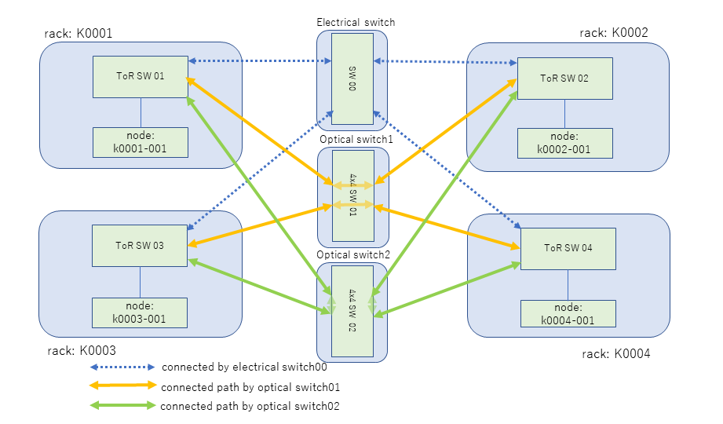

## MEOW Network Controller: Getting started

### Supported Environment

- Linux CentOS 7.9
- ONOS 2.7.0
- Bazel 3.7.1
- Apache Maven 3.8.4
- OpenJDK 11.0.16 2022-07-19 LTS

### Setup ONOS 2.7.0
#### Build from source code

Get the source code from [github](https://github.com/opennetworkinglab/onos), build and start it.

```sh
git clone https://github.com/opennetworkinglab/onos
cd onos
git checkout 2.7.0
bazel build onos
bazel run onos-local -- clean
```
#### Use binary package

The pre-built X-Wing (LTS) package is available from [the official ONOS web page](https://wiki.onosproject.org/display/ONOS/Downloads). You just extract and run it.

```sh
curl https://repo1.maven.org/maven2/org/onosproject/onos-releases/2.7.0/onos-2.7.0.tar.gz
tar x onos-2.7.0.tar.gz
bin/onos-service
```

### Setup MEOW Network Controller (meow-rest)

#### Build meow-rest

```sh
git clone git@github.com:ryousei/meow-rest.git
cd meow-rest/meow-app
mvn clean install
```

#### Install meow-rest and launch the service

```sh
onos-app localhost reinstall! target/meow-app-1.0-SNAPSHOT.oar 
```
Since here we use 'reinstall' subcommand, you will get an error at first. You can ignore it.

#### Launch a pseudo-EtherCAT master

Before loading the meow-rest configuration file, it is necessary to start the EtherCAT master. We provide a pseudo-EtherCAT master program for checking the operation. The IP address and port number of the EtherCAT master are defined in [master.json](meow-app/input/master.json). In the following example, two pseudo-EtherCAT masters are launched to control two optical planes.

```sh
gcc -o server meow-rest/meow-app/test/server-I16.c
. /server 54890
(Execute the following command from another terminal)
. /server 54892
```

#### Load the optical switch configuration
The sample script [test.sh](meow-app/test.sh) is used here.

```sh
sh test.sh
```

```sh
$ cat test.sh
#! /bin/bash
#
#  Copyright (c) 2022 National Institute of Advanced Industrial Science 
#  and Technology (AIST). All rights reserved.
# 
URL=http://localhost:8181/onos/meow-app/controller

curl -u karaf:karaf -X GET $URL/disconnect
echo
#
if [ "YES" = "YES" ]; then
    onos-app localhost reinstall! target/meow-app-1.0-SNAPSHOT.oar 
    # onos-app localhost install target/meow-app-1.0-SNAPSHOT.oar 
    sleep 1
fi

if [ "YES" = "YES" ]; then
    curl -u karaf:karaf -H "Content-Type: application/json" -d @input/Full4x4_tpl_config.json -X POST $URL/table5
    echo
    sleep 1
fi

curl -u karaf:karaf -H "Content-Type: application/json" -d @input/lsw-device.json  -X POST $URL/table5
echo
sleep 1

curl -u karaf:karaf -H "Content-Type: application/json" -d @input/osw-device.json  -X POST $URL/table5
echo
sleep 1

curl -u karaf:karaf -H "Content-Type: application/json" -d @input/master.json  -X POST $URL/table5
echo
sleep 1

curl -u karaf:karaf -H "Content-Type: application/json" -d @input/port.json  -X POST $URL/table5
echo
sleep 1

if [ "YES" = "NO" ]; then
    curl -u karaf:karaf -H "Content-Type: application/json" -d @input/REQ-4x4-ring-BI.json  -X POST $URL/setpaths
    echo
    sleep 10

    curl -u karaf:karaf -X DELETE $URL/gid/GID000
    echo
fi
```

You needs to change the URL definition with the meow-rest service URL. 

[test.sh](meow-app/test.sh) reads several configuration files as follows:

#### Configuration Files

| File name                 | Description |
| --- | --- |
| Full4x4_tpl_config.json   |Port setting of optical space switch (osw) and wavelength and port setting of optical wavelength switch (lsw) required to connect src port and dst port. rv_ prefix is the setting in the opposite direction.
| lsw-device.json           | Configuration of MEOW board ID (MasterID), EtherCAT master ID (SubMasterID) and EtherCAT slave ID (SlaveID) to control the optical wavelength switches. |
| osw-device.json           | Configuration of MEOW Board ID (MasterID), EtherCAT Master ID (SubMasterID) and EtherCAT Slave ID (SlaveID) to control the optical space switches. |
| master.json               | Define how to access the EtherCAT master, set port number and IP address, user and password. |
| port.json                 |  Connection table for optical switch and rack |

### How to control optical paths

The following example is an example of optical path control in a simple data center network with a 4-rack configuration.



#### Optical Path Topology Definition

To connect the 4 nodes with a ring configuration (-> k0001-001 -> k0002-001 -> k0004-001 -> k0003-001 -->), create the following request. This will be used to send a setup request to the ONOS controller using REST-IF to configure a network with a ring topology.

```sh
$ cat input/REQ-4x4-ring-BI.json 
{"requests":[
    {"dir":"BI","src":"K0001","dst":" K0002","user":"meowadmin",
     "hosts":["K0001-001", "K0002-001"]},
    {"dir":"BI","src":"K0002","dst":" K0004","user":"meowadmin",
     "hosts":["K0002-001", "K0004-001"]},
    {"dir":"BI","src":"K0004","dst":" K0003","user":"meowadmin",
     "hosts":["K0004-001", "K0003-001"]},
    {"dir":"BI","src":"K0003","dst":" K0001","user":"meowadmin",
     "hosts":["K0003-001", "K0001-001"]}
]}
```

#### Parameter Description
| Parameter | Description |
| --- | --- |
| dir       | BI: bi-direction, FW: forward direction, BW: backward direction |
| src, dst  | Source and destination racks K0000: 4-digit racks number |
| hosts     | Host name to use for the path set up. Rack number - 3-digit host number |
| user      | User name of the user who will use the set up path |

#### How to setup optical paths

```sh
$ export URL=http://localhost:8181/onos/meow-app/controller
$ curl -u karaf:karaf -H "Content-Type: application/json" -d @input/REQ-4x4-ring-BI.json  -X POST $URL/setpaths
```

#### How to teardown optical paths

```sh
$ curl -u karaf:karaf -X DELETE $URL/gid/GID000
{"OK:removePaths":"GID000 is remove now."}
```

### MPI Program Execution

The following is an example of running ring-based AllReduce with MPI over an optical path network.

#### Optical path setup with meow-rest


```sh
$ export URL=http://localhost:8181/onos/meow-app/controller
$ curl -u karaf:karaf -H "Content-Type: application/json" -d @input/REQ-4x4-ring-BI.json  -X POST $URL/setpaths
```

```sh
$ ssh k0001-001 cat hostlist4.ring
k0001-001
k0002-001
k0004-001
k0003-001
```

```sh
$ ssh K0001-001 mpirun --mca coll_base_verbose 1 --mca coll_tuned_use_dynamic_rules 1 --mca coll_tuned_allreduce_algorithm 4 -np 4 -pernode -hostfile hostlist4.ring osu/bin/osu_allreduce
# OSU MPI Allreduce Latency Test v5.7.1
# Size       Avg Latency(us)
4                      74.85
8                      69.71
16                    288.74
32                    290.08
64                    288.95
128                   287.59
256                   288.16
512                   289.64
1024                  289.88
2048                  309.25
4096                  510.29
8192                  830.78
16384                1100.55
32768                1320.32
65536                1629.05
131072               2549.42
262144               1042.91
524288               1469.63
1048576              2242.14
```

#### Optical path teardown with meow-rest

Remove the optical paths with a teardown request.

```sh
$ curl -u karaf:karaf -X DELETE $URL/gid/GID000
{"OK:removePaths":"GID000 is remove now."}
```
